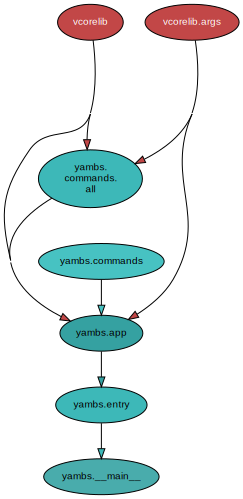

<!--
    =====================================
    generator=datazen
    version=3.1.2
    hash=0f4386a6affa598c310b2ec58d5f608f
    =====================================
-->

# yambs ([2.1.0](https://pypi.org/project/yambs/))

[](https://pypi.org/project/yambs/)

[](https://codecov.io/github/vkottler/yambs)


*Yet another meta build-system.*

See also: [generated documentation](https://vkottler.github.io/python/pydoc/yambs.html)
(created with [`pydoc`](https://docs.python.org/3/library/pydoc.html)).

## Python Version Support

This package is tested with the following Python minor versions:

* [`python3.8`](https://docs.python.org/3.8/)
* [`python3.9`](https://docs.python.org/3.9/)
* [`python3.10`](https://docs.python.org/3.10/)
* [`python3.11`](https://docs.python.org/3.11/)

## Platform Support

This package is tested on the following platforms:

* `ubuntu-latest`
* `macos-latest`
* `windows-latest`

# Introduction

It's undeniable that a software engineer must implement some project-workflow
tooling as a coming-of-age endeavor.

Your current workflow is slow and cumbersome? Time to roll up your sleeves and
improve it!

What does every build system on the block advertise? *Speed* of course!

What else do they advertise? Scalability! Compile source repositories that only
fleets of data centers can even fathom checking out entire source trees of.
Compile your whole company's software stack in only eight hours! (Down from
ten from the previous build-system we used!!!)

**Most build systems optimize for technical problem solving, and leave
user-facing configuration and recurring-interaction mechanisms an
afterthought.**

Want to use our awesome tool that solves every hard computer-science problem
known to mankind? Sorry but you need to learn a totally bespoke programming
language to get started. What's that? Does it have linting + formatting +
static-analysis tooling? Your text editor doesn't even ship with syntax
highlighting out of the box? C'mon just configure your build. Buy some books
on Amazon and spend a few days reading the manual cover-to-cover.

This project aims at bringing sanity to the user-facing parts of build systems:
**the commands you enter, and the coherence of configuration data that actually
warrants human management** (and not automated generation).

## Prior Art

* [vmklib](https://github.com/vkottler/vmklib) - a "Makefile library" with a
Python extensibility interface, great for generic project workflow tasks, but
not specific enough for meta build-system purposes
* [datazen](https://github.com/vkottler/datazen) - a solution for connecting
the awesomeness of [Jinja](https://jinja.palletsprojects.com/en/3.1.x/) to
data and template directories, eliminating a need for writing bespoke code
to generate common boilerplate when a bit of configuration data is sufficient
* [rcmpy](https://github.com/vkottler/rcmpy) - a more targeted `datazen`,
focused on a "put templates and configuration data here" approach to
generating userspace configuration files (for e.g. your developer workstation
editor, shell and other configurations)
* [userfs](https://github.com/vkottler/userfs) - a tool for performing
arbitrary fresh-system bootstrapping tasks (cloning repositories, building
and installing software from source) at the userspace level, rather than as
a privileged user

# Y.A.W.R

`yambs` ain't wheel reinvention.

This isn't a build-system alternative - it generates build instructions for
[ninja](https://ninja-build.org/).

What's that? Have I heard of [CMake](https://cmake.org/)?
[Meson](https://mesonbuild.com/) perhaps? What about
[Bazel](https://bazel.build/)? GNU's [Make](https://www.gnu.org/software/make/)
is a timeless classic.

## Build System Cardinal Sins

### Infinite Configurability and Flexibility

It's understandable that almost every build system implementation begins with
the objective of compiling sources and linking programs from an *existing*
source tree, with probably a lot of inconsistent organization conventions.

This drives complexity into the build system's interface for being told what
to do. **It's rare for any build system to have an out-of-the-box notion of
where to look for things and what work to do.**

### Infinite Scalability

Isn't any modern piece of software junk if it can't scale to millions of
concurrent network connections / disk read-write tasks / computations?

That's what the current software engineering zeitgeist will tell you. Why
define conventions for small/medium projects, trivial to spawn the N+1'th
instance when the need arises, when you can spend all of your time making an
infinitely scalable build system for every line of code that thousands of
people are contributing every day?

## Solutions

1. Sane out-of-the-box conventions: put your code here (and organize it by
following a specific convention), put your configuration data here.

# Command-line Options

```
$ ./venv3.11/bin/mbs -h

usage: mbs [-h] [--version] [-v] [-C DIR] {dist,gen,native,uf2conv,noop} ...

Yet another meta build-system.

options:
  -h, --help            show this help message and exit
  --version             show program's version number and exit
  -v, --verbose         set to increase logging verbosity
  -C DIR, --dir DIR     execute from a specific directory

commands:
  {dist,gen,native,uf2conv,noop}
                        set of available commands
    dist                create a source distribution
    gen                 poll the source tree and generate any new build files
    native              generate build files for native-only target projects
    uf2conv             convert to UF2 or flash directly
    noop                command stub (does nothing)

```

## Sub-command Options

### `dist`

```
$ ./venv3.11/bin/mbs dist -h

usage: mbs dist [-h] [-c CONFIG] [-s]

options:
  -h, --help            show this help message and exit
  -c CONFIG, --config CONFIG
                        the path to the top-level configuration file (default:
                        'yambs.yaml')
  -s, --sources         set this flag to only capture source files

```

### `gen`

```
$ ./venv3.11/bin/mbs gen -h

usage: mbs gen [-h] [-c CONFIG] [-i] [-w] [-s]

options:
  -h, --help            show this help message and exit
  -c CONFIG, --config CONFIG
                        the path to the top-level configuration file (default:
                        'yambs.yaml')
  -i, --single-pass     only run a single watch iteration
  -w, --watch           whether or not to continue watching for source tree
                        changes
  -s, --sources         whether or not to only re-generate source manifests

```

### `native`

```
$ ./venv3.11/bin/mbs native -h

usage: mbs native [-h] [-c CONFIG] [-i] [-w] [-s]

options:
  -h, --help            show this help message and exit
  -c CONFIG, --config CONFIG
                        the path to the top-level configuration file (default:
                        'yambs.yaml')
  -i, --single-pass     only run a single watch iteration
  -w, --watch           whether or not to continue watching for source tree
                        changes
  -s, --sources         whether or not to only re-generate source manifests

```

### `uf2conv`

```
$ ./venv3.11/bin/mbs uf2conv -h

usage: mbs uf2conv [-h] [-b BASE] [-f FAMILY] [-o FILE] [-d DEVICE_PATH] [-l]
                   [-c] [-D] [-w] [-C] [-i]
                   [INPUT]

positional arguments:
  INPUT                 input file (HEX, BIN or UF2)

options:
  -h, --help            show this help message and exit
  -b BASE, --base BASE  set base address of application for BIN format
                        (default: 0x2000)
  -f FAMILY, --family FAMILY
                        specify familyID - number or name (default: 0x0)
  -o FILE, --output FILE
                        write output to named file; defaults to "flash.uf2" or
                        "flash.bin" where sensible
  -d DEVICE_PATH, --device DEVICE_PATH
                        select a device path to flash
  -l, --list            list connected devices
  -c, --convert         do not flash, just convert
  -D, --deploy          just flash, do not convert
  -w, --wait            wait for device to flash
  -C, --carray          convert binary file to a C array, not UF2
  -i, --info            display header information from UF2, do not convert

```

# Internal Dependency Graph

A coarse view of the internal structure and scale of
`yambs`'s source.
Generated using [pydeps](https://github.com/thebjorn/pydeps) (via
`mk python-deps`).


