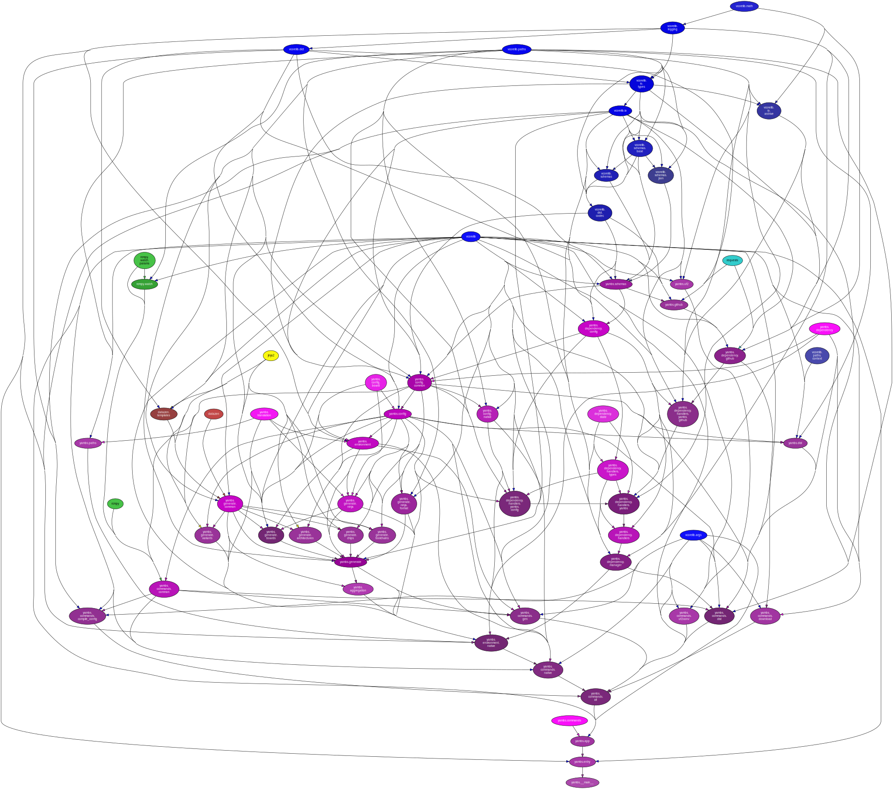

<!--
    =====================================
    generator=datazen
    version=3.1.2
    hash=c6df3f66b4c544f3839e0b5482039ade
    =====================================
-->

# yambs ([0.1.0](https://pypi.org/project/yambs/))

[](https://pypi.org/project/yambs/)

[](https://codecov.io/github/vkottler/yambs)


*Yet another meta build-system.*

See also: [generated documentation](https://vkottler.github.io/python/pydoc/yambs.html)
(created with [`pydoc`](https://docs.python.org/3/library/pydoc.html)).

## Python Version Support

This package is tested with the following Python minor versions:

* [`python3.7`](https://docs.python.org/3.7/)
* [`python3.8`](https://docs.python.org/3.8/)
* [`python3.9`](https://docs.python.org/3.9/)
* [`python3.10`](https://docs.python.org/3.10/)

## Platform Support

This package is tested on the following platforms:

* `ubuntu-latest`
* `macos-latest`
* `windows-latest`

# Introduction

# Command-line Options

```
$ ./venv3.11/bin/mbs -h

usage: mbs [-h] [--version] [-v] [-C DIR] {noop} ...

Yet another meta build-system.

options:
  -h, --help         show this help message and exit
  --version          show program's version number and exit
  -v, --verbose      set to increase logging verbosity
  -C DIR, --dir DIR  execute from a specific directory

commands:
  {noop}             set of available commands
    noop             command stub (does nothing)

```

# Internal Dependency Graph

A coarse view of the internal structure and scale of
`yambs`'s source.
Generated using [pydeps](https://github.com/thebjorn/pydeps) (via
`mk python-deps`).


